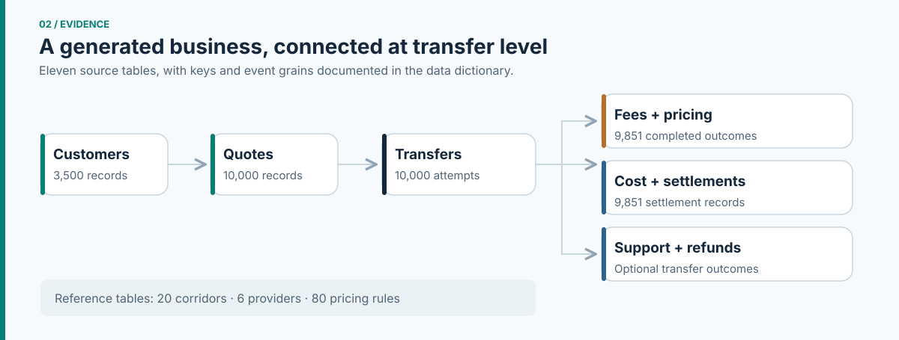
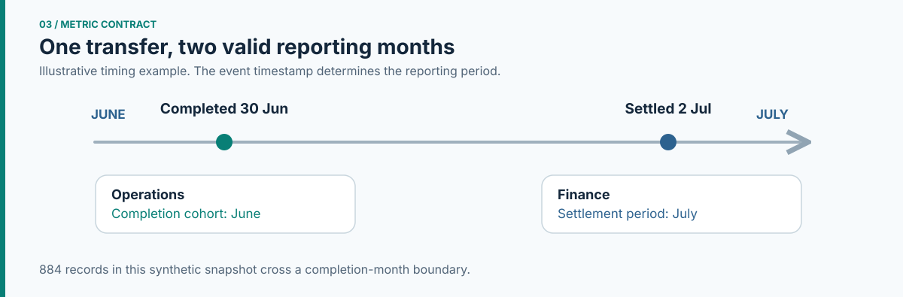
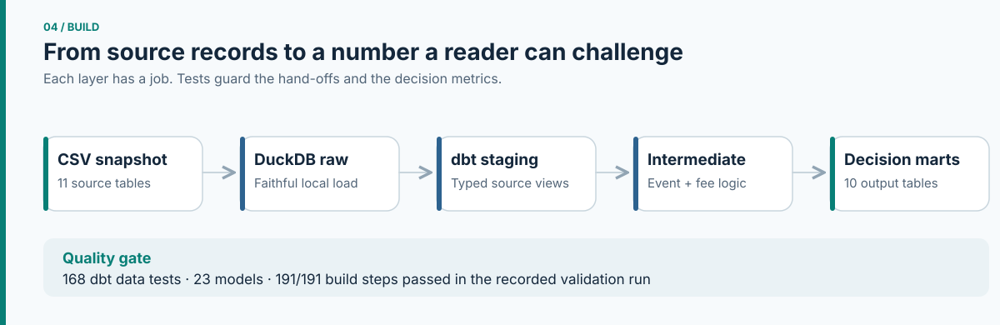
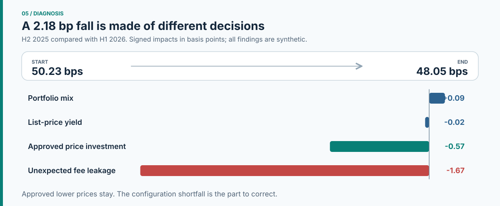
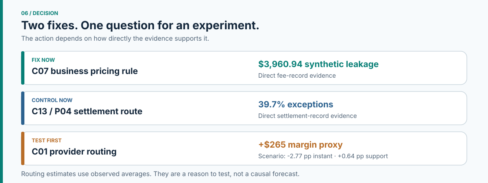

# Fintech Analytics Decision Room

**One falling metric. Several possible causes. Which one deserves action?**

I built this independent payments analytics case to follow a decision from the first business question to a recommendation. The setting was inspired by [Wise's public disclosures](docs/source_register.md), but the customers, transfers, providers, analysis and findings here are **synthetic**. This is not a study of Wise's internal operations, and I have no affiliation with Wise.

The question: **How can a payments fintech lower prices and make transfers faster without losing sight of its unit economics and operational controls?**

## The answer in a minute

In this simulation, collected take rate fell from **50.23 to 48.05 basis points**. Part of that movement was an approved price reduction; another part was an unexpected fee configuration fault. A separate settlement issue was concentrated on one provider route. The fastest route also cost more, but its observed results were not enough to justify switching providers outright.

My decision was to **fix the two observed controls and test the routing idea**. The [executive memo](reports/executive_memo.md) gives the short version. The six steps below show how I got there.

## 1. Frame the decision

A lower take rate is a signal, not a diagnosis. Before analysing transfers, I wrote down the questions that would change the decision: how much came from intended price investment, whether Finance and Operations were counting different events, where exceptions were concentrated, and whether more speed justified more cost.

That scope and the initial hypotheses are in the [case brief](docs/project_charter.md). The [source register](docs/source_register.md) separates public company context from project assumptions and synthetic results.

## 2. Build evidence I can inspect

I generated a connected payments dataset with **10,000 transfer attempts**, **3,500 customers** and **11 source tables** across **20 corridors**. A fixed seed and published [scenario settings](config/scenarios.yml) make the injected patterns explicit. This is a designed analytical exercise; the problems shown in the data were not discovered at a real company.

The [generator](src/fintech_sim/generator.py) creates the records, the [data dictionary](docs/data_dictionary.md) defines their grains and keys, and the [snapshot validation](reports/prototype_validation.md) checks the relationships and scenario patterns.

## 3. Settle the meaning of the numbers

The first modelling choice was about time. Operations sees a transfer when it completes; Finance can see the settlement in a different month. A monthly total without its event timestamp invites a false disagreement.

I kept both clocks, then connected them with a [reporting-period bridge](dbt_fintech/models/marts/mart_reporting_period_reconciliation.sql). I also kept list fee, approved reduction, expected fee and collected fee as separate amounts. The [metric contract](docs/metric_contract.md) records the formulas, populations and tolerances; the [bridge test](dbt_fintech/tests/assert_reporting_period_bridge_reconciles.sql) checks that the monthly views reconcile.

## 4. Build the analytical layer

I loaded the source records into DuckDB, typed them in dbt, joined costs and fees at transfer grain, and only then aggregated them for decisions. This order keeps a plausible-looking dashboard from hiding a join or timing error.

The [architecture](docs/architecture.md) explains each layer. You can inspect the [staging models](dbt_fintech/models/staging), the [transfer-level economic model](dbt_fintech/models/intermediate/int_transfer_unit_economics.sql), the [decision marts](dbt_fintech/models/marts) and the [business-rule tests](dbt_fintech/tests). The recorded validation run passed **23 models and 168 data tests**, or **191 of 191 build steps**. [See the validation evidence](reports/metric_layer_validation.md).

## 5. Find what actually moved

The headline decline was **2.18 bps** between H2 2025 and H1 2026. A volume-weighted bridge showed that **0.57 bp** was approved lower pricing, while **1.67 bps** came from a fee configuration shortfall. Mix and list-price yield nearly cancelled each other. Treating the full decline as a pricing failure would undo an intended customer benefit and miss the faulty rule.

Two more findings changed the next action:

| Evidence from the synthetic dataset | What it means for the decision |
| --- | --- |
| The C07 business segment contains **215 affected transfers** and **$3,960.94** in fee leakage. | Correct this specific pricing configuration and reconcile its fee records. |
| C13/P04 has a **39.7%** settlement exception rate in the target window, versus **4.2%** on other routes. | Assign a route-level owner and control instead of treating it as a portfolio-wide failure. |
| The C01 priority route is **98.4% instant** but costs **21.43 bps**, versus **8.67 bps** on other C01 routes. | Investigate the trade-off. The observed route groups are not a causal comparison. |

The [diagnostic report](reports/diagnostic_analysis.md) gives the periods and denominators. The SQL behind the central movement is in the [take-rate bridge](dbt_fintech/models/marts/mart_take_rate_bridge.sql); the other views are in the [exception](dbt_fintech/models/marts/mart_reconciliation_exceptions.sql) and [speed-cost](dbt_fintech/models/marts/mart_speed_cost_tradeoff.sql) marts.

## 6. Decide what to fix and what to test

The pricing shortfall and settlement pattern are visible directly in the synthetic records, so I recommended targeted fixes. Routing is different: the faster provider handled a different set of transfers, and observed averages cannot tell us what would happen if the same transfers took another route. I proposed a controlled test with contribution, speed, support and settlement guardrails.

The [decision memo](reports/executive_memo.md) sets the sequence. The [experiment design](reports/experiment_design.md) states eligibility, treatment, metrics and stop conditions. The [decision log](docs/decision_log.md) records the choices and what evidence could change them.

## Where the proof lives

| Area | Files |
| --- | --- |
| Generated records and assumptions | [Data snapshot](data/prototype) · [generator](src/fintech_sim/generator.py) · [scenario settings](config/scenarios.yml) |
| Definitions and transformations | [Metric contract](docs/metric_contract.md) · [dbt models](dbt_fintech/models) · [architecture](docs/architecture.md) |
| Checks | [Prototype validation](reports/prototype_validation.md) · [dbt tests](dbt_fintech/tests) · [build validation](reports/metric_layer_validation.md) |
| Findings and decision | [Diagnostic analysis](reports/diagnostic_analysis.md) · [executive memo](reports/executive_memo.md) · [experiment](reports/experiment_design.md) |

The figures on this page are drawn from the documented model and snapshot by [this visual script](scripts/build_readme_visuals.py). They are part of the case explanation, not social media artwork.

**Limits:** All transaction-level findings are synthetic. The contribution metric is a proxy that leaves out several real costs. The routing scenario uses observed averages, not a causal estimate. Those limits are why the case ends with a controlled experiment rather than a broad routing change.

Built by Victor Moraes Garlet as an independent portfolio simulation.
