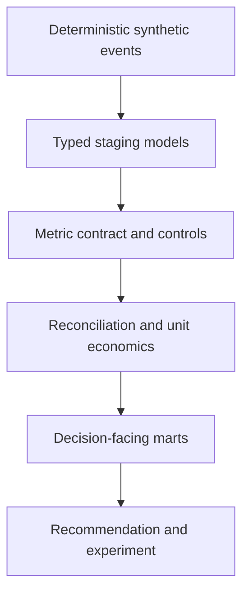

# 30 Days Inside a European Fintech

> A public Senior Data Analyst simulation inspired by Wise's business model and public disclosures.

This project follows one decision from business signal to recommendation:

**How can a European payments fintech lower prices and improve transfer speed without losing control of unit economics?**

It is designed as a decision case, not a gallery of dashboards. The work makes metric definitions, reconciliation rules, data-quality controls, trade-offs and limitations inspectable.

## Current status

**Milestone 2 — trusted analytical layer validated**

| Evidence | Current result |
| --- | ---: |
| Synthetic transfer attempts | 10,000 |
| Synthetic customers | 3,500 |
| Currency corridors | 20 |
| Raw source tables | 11 |
| dbt models | 18 |
| Automated dbt tests | 145 |
| Latest `dbt build` | 163 / 163 passed |

The next milestone is the diagnostic analysis: reconciling Finance and Operations views, then decomposing take-rate movement before any recommendation is made.

## The analytical path



The local path uses DuckDB so anyone can inspect the work without a cloud account. The same transformation logic is intended to run in BigQuery when the full-scale dataset is introduced.

## What is implemented

- Deterministic Python generator with fixed seeds and referentially consistent IDs.
- A committed 10,000-transfer synthetic snapshot for public reproducibility.
- DuckDB raw layer and compressed Parquet export.
- dbt staging, reconciliation, unit-economics and decision-mart layers.
- Tests for keys, relationships, accepted values, accounting equations, settlement coverage, business-event timing and mart reconciliation.
- Generated dbt documentation and lineage metadata.
- Source register, data dictionary, metric contract and project charter.
- A private scenario boundary so controlled issues are not revealed before the relevant investigation.

## Repository map

```text
.github/workflows/     CI quality gate
config/                Public generation settings and domain definitions
data/prototype/        Committed synthetic prototype snapshot
dbt_fintech/           SQL models, model contracts, tests and lineage
docs/                  Business context, metrics, architecture and decisions
reports/               Internal validation evidence
scripts/               Data loading, export and generation entry points
site/                  Portfolio experience, prepared for a later public release
src/fintech_sim/       Reusable generation and validation logic
tests/                 Python snapshot and internal scenario tests
```

`config/private/`, local warehouse files and unreleased investigation details are deliberately excluded from version control.

## Run the public build locally

Python 3.12 and `make` are recommended.

```bash
make setup
make build
```

The public build:

1. validates the committed synthetic snapshot;
2. loads all raw tables into DuckDB;
3. creates the complete dbt DAG;
4. executes the data-quality and reconciliation suite;
5. generates the dbt catalog and lineage artifacts.

Individual commands are also available:

```bash
make test
make load
make dbt-build
make dbt-docs
make export
```

The maintainer-only `make regenerate` command requires the unreleased scenario configuration. That boundary will be removed or versioned when the investigation reaches its final public release.

## Evidence rules

Every material statement in the project belongs to one of three classes:

| Label | Meaning |
| --- | --- |
| **Public fact** | A company-level statement linked to an official publication. |
| **Project assumption** | A documented modelling choice needed for a coherent simulation. |
| **Synthetic result** | A finding created only from the fictional dataset. |

See the [project charter](docs/project_charter.md), [metric contract](docs/metric_contract.md), [data dictionary](docs/data_dictionary.md) and [architecture](docs/architecture.md) for the review trail.

## Integrity boundary

- Wise provides public business context only.
- Victor does not claim employment, affiliation, endorsement or internal access.
- All transaction-level records and analytical findings are synthetic.
- Fictional provider names, costs and events do not describe real organisations.
- No real customer, employee or internal company data is used.

## Public series

The build will be documented through eight LinkedIn episodes under **30 Days Inside a European Fintech**. Each episode will stand alone, add one piece of evidence and end with the full simulation disclosure. Posts and public deployment remain subject to individual approval.

---

**Simulation disclosure:** This is an independent portfolio project using Wise only as public business context. All transaction-level data, findings and recommendations are fictional and do not represent Wise or its internal operations.
