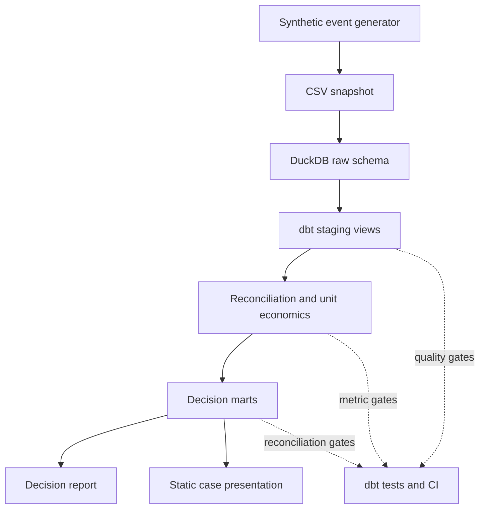

# Analytics Architecture

**Version:** 1.0
**Status:** Decision layer validated
**Primary design goal:** make every decision-facing number traceable to a source event, a definition and a test.

## System view

## Why this shape

| Design choice | Business reason | Technical implementation |
| --- | --- | --- |
| Preserve raw events | An analyst must be able to trace a disputed number back to its source grain. | Eleven CSV sources loaded unchanged into the DuckDB `raw` schema. |
| Separate completion and settlement time | Product and Finance can both be correct while assigning the same transfer to different months. | `int_reconciliation_bridge` carries both dates and flags cross-month records. |
| One transfer-level economic spine | Price, provider cost and service cost need a shared grain before aggregation. | `int_transfer_unit_economics` joins completed transfers to fees, provider cost, support and refunds. |
| Marts by decision | Monitoring and diagnosis require different levels of detail. | Executive, corridor, provider, transfer and exception marts. |
| Local-first execution | Review should not require paid infrastructure or credentials. | DuckDB plus committed synthetic data; BigQuery is the scale target, not a dependency. |
| Test the business rules | A green SQL query is not evidence that its business meaning is correct. | 168 source, model and singular dbt tests, including accounting, bridge and scenario assertions. |

## Model layers

| Layer | Materialisation | Responsibility |
| --- | --- | --- |
| `raw` | DuckDB tables | Faithful ingestion of committed synthetic source files. |
| `staging` | Views | Types, names and source-level semantics. |
| `intermediate` | Views | Reusable event alignment, reconciliation and unit-economics logic. |
| `marts` | Tables | Stable interfaces for business analysis and reporting. |

## Reproduction boundary

The completed simulation includes its scenario settings, code, CSV snapshot, SQL models, metric definitions and tests. A reader can regenerate the source tables and rebuild the decision marts locally.

Real personal information, credentials and non-public company data do not belong in this repository.

## Deployment path

The current build runs locally and in GitHub Actions. The reports and static presentation summarise the decision marts.

Potential extensions are deliberately separate from the completed case:

1. BigQuery for an approximately one-million-transfer scale run.
2. Static dbt documentation for browsable lineage.
3. GitHub Pages deployment if a separate visual presentation is useful.
4. A native Power BI semantic model if a `.pbix` delivery is required.

Each addition must improve reviewability or decision use. None is required to validate the current analytical logic.
