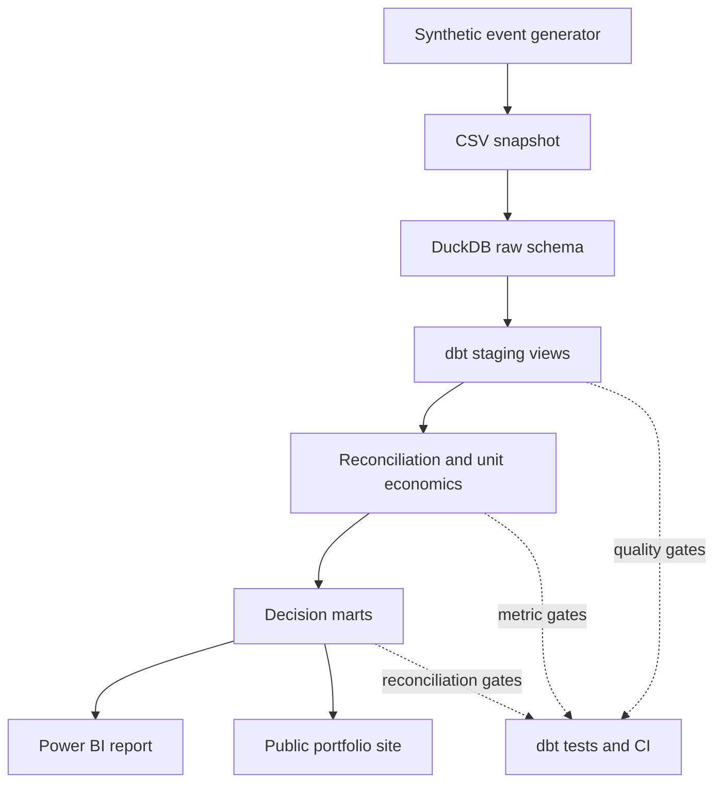

# Analytics Architecture

**Version:** 0.2
**Status:** Local metric layer validated
**Primary design goal:** make every decision-facing number traceable to a source event, a definition and a test.

## System view

## Why this shape

| Design choice | Business reason | Technical implementation |
| --- | --- | --- |
| Preserve raw events | An analyst must be able to trace a disputed number back to its source grain. | Eleven CSV sources loaded unchanged into the DuckDB `raw` schema. |
| Separate completion and settlement time | Product and Finance can both be correct while assigning the same transfer to different months. | `int_reconciliation_bridge` carries both dates and flags cross-month records. |
| One transfer-level economic spine | Price, provider cost and service cost need a shared grain before aggregation. | `int_transfer_unit_economics` joins completed transfers to fees, provider cost, support and refunds. |
| Marts by decision | Monitoring and diagnosis require different levels of detail. | Executive, corridor, provider, transfer and exception marts. |
| Local-first execution | Review should not require paid infrastructure or credentials. | DuckDB plus committed synthetic data; BigQuery is the scale target, not a dependency. |
| Test the business rules | A green SQL query is not evidence that its business meaning is correct. | 145 source, model and singular dbt tests, including accounting and reconciliation assertions. |

## Model layers

| Layer | Materialisation | Responsibility |
| --- | --- | --- |
| `raw` | DuckDB tables | Faithful ingestion of committed synthetic source files. |
| `staging` | Views | Types, names and source-level semantics. |
| `intermediate` | Views | Reusable event alignment, reconciliation and unit-economics logic. |
| `marts` | Tables | Stable interfaces for business analysis and reporting. |

## Public and private boundary

The repository is designed to become public without leaking the controlled scenario targets prematurely.

- Public: source code, public configurations, synthetic snapshot, SQL models, metric definitions, tests and eventually curated outputs.
- Private until the related episode: exact scenario targets and the internal detectability report.
- Never included: real personal information, production credentials or non-public company information.

## Deployment path

The current build runs entirely locally and in GitHub Actions. Later milestones will add:

1. BigQuery for the approximately one-million-transfer scale run.
2. Static dbt documentation for browsable lineage.
3. A GitHub Pages portfolio experience with a curated DuckDB/Parquet query surface.
4. A Power BI semantic model and decision-facing report.

Each addition must improve reviewability or decision use. None is required to validate the current analytical logic.
